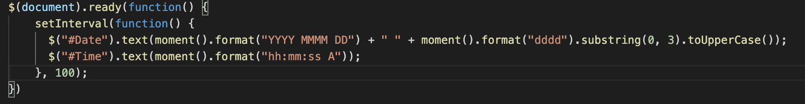
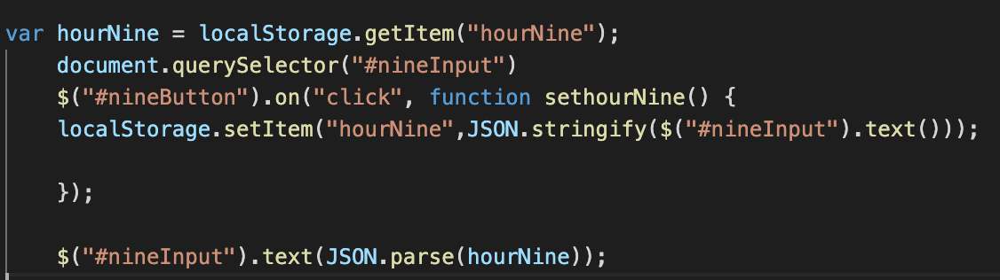

# Work-Day-Planner
This project is about making your own to do everyday list. I started off with creating the html, css and js files.
I also changed the title name and added an h1 using bootstrap

## Date and Time
What I did first is I added the date and time using moment.js
* I created a whole new div tag 

* I followed the instructions for using the templates in moment.js

## Planner Template
I started adding the timeblocks from 9am to 5pm

## Local Storage
I started working on the formula for the local storage an I did it for all the hours

## Color Rows
For this part of the deliverable, I added if statements and changed the background as the time goes up
